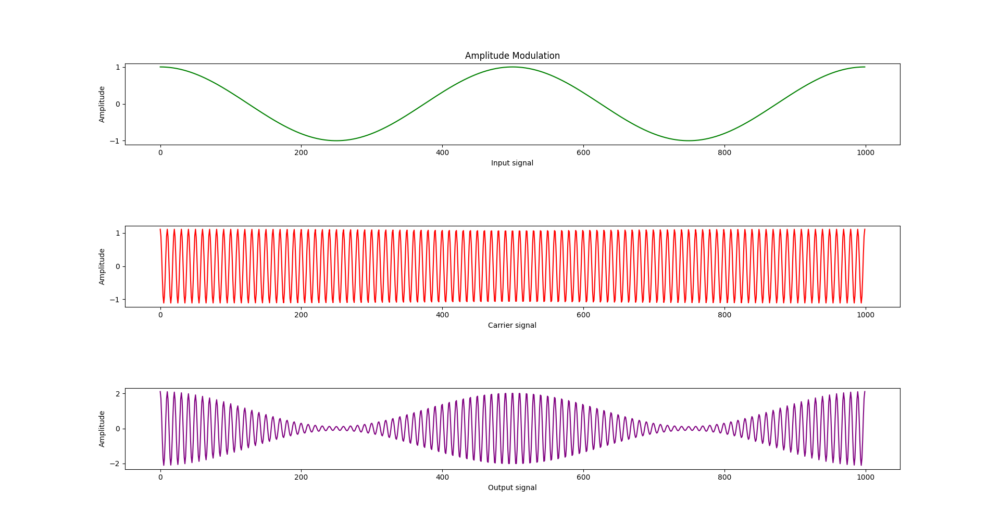
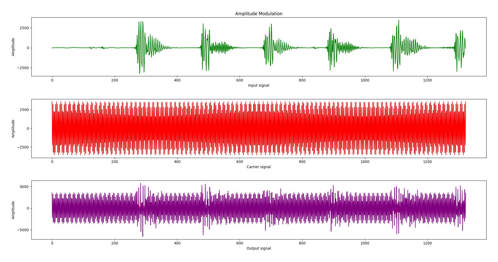

# Principals of Communication Systems

This repository contains solution for PCS course (Semester V) assignment at VJTI, Mumbai

# Generate sample data

* To generate a sample cos signal as the input signal, run the following command:

  ```bash
  python3 generate_signal.py
  ```

  Output of the file, enter the number of data points to generate, we take 1000 data points for this example

  ```bash
  Enter number of elements: 1000
  ```

  This will generate a file called `data.txt` with float values on each line.

* To generate a sample signal from two of the following audio samples:
  * [Pink Panther](assets/PinkPanther60.wav)
  * [Cantina Band](assets/CantinaBand3.wav)

  ```bash
  python3 generate_wav_to_file.py
  ```

  Output of this file, select the file to generate the float samples, we select the second audio file:

  ```bash
  Press 1 for PinkPanther60.wav
  Press 2 for CantinaBand3.wav
  Enter option: 2
  ```

  This will generate a file called `data.txt` with float values on each line.

# Amplitude Modulation

> Write a program in MATLAB/Python/Scilab (any) to generate an AM wave for a given modulation index and modulating signal. The modulation index, carrier frequency and modulating signal must be taken as input from user.

> Plot one signal below the other in a single figure as subparts, for convenient visualization.

To generate AM output signal, run the following command:
    
```bash
python3 am_modulation.py
```

Output of python file

```bash
Enter File Name: data.txt
Enter value of modulation index (0-1): 0.9
Enter value of carrier frequency: 100000
```

#### Cosine signal as input



#### Cantina Band audio file as input


